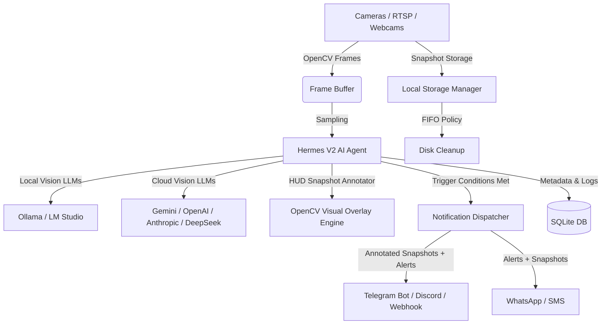

# AEGIS V2: Real-Time Edge Video Analytics & Intelligence Platform 🚀

AEGIS V2 is an edge-native video intelligence platform that transforms standard video feeds (webcams, IP cameras, and RTSP streams) into smart, context-aware security systems. By combining local, vision-capable Large Language Models (Vision-LLMs) with automated notification channels, AEGIS allows you to define security and monitoring rules in plain, natural language.

---

## 🔥 What's New in AEGIS V2.0

* 🎛️ **Multi-Stream Live Camera Grid**: Switch seamlessly between `1x1`, `2x2`, and `Auto Grid` monitoring modes in real time.
* 🖼️ **HUD Vision Snapshots & Bounding Overlays**: Automatically generates HUD annotated snapshots with timestamps, confidence scores, severity badges, and visual target frames.
* ⚡ **Interactive AI Test Runner**: Test any natural language condition live against camera feeds in 1-click before saving permanent triggers.
* 📦 **Pre-Built AI Security Presets**: One-click library of pre-configured rules for package theft watch, intruder alerts, vehicle detection, loitering, and pet sofa monitoring.
* 📊 **Real-Time Hardware & AI Metrics Gauges**: Live monitoring of CPU %, Memory, Storage rotation, active camera streams, and Hermes AI latency.
* 🔔 **Chime Sound Alerts & Multi-Channel Dispatch**: Browser audio alerts for critical events, plus dispatching to Telegram, Discord, Webhooks, and SMS.
* 🌐 **AEGIS Live Phone Control**: Instant secure public tunnel link generation for remote mobile live stream preview and Telegram bot controls.

---

## 💡 The Core Idea & Project Basis

Traditional security systems rely on basic motion detection or pre-trained, rigid object detection models (like YOLO) that can only detect generic categories (e.g., "person", "car"). They suffer from high rates of false positives (leaves blowing, shadows changing) and cannot understand complex contexts.

**AEGIS V2 changes this by introducing Vision-LLMs to the edge.** Instead of writing code or configuring complex zones, you simply describe what you want to monitor in natural language:
* *"Detect if someone is holding a package near the door."*
* *"Alert me if the dog gets on the dark brown couch."*
* *"Check if a delivery truck parked in the driveway."*

The core background orchestrator, **Hermes**, continuously samples frames from your cameras, feeds them to your choice of local or cloud-based Vision-LLMs, evaluates the frame against your natural language triggers, and immediately dispatches rich alerts (complete with annotated snapshots) directly to your messaging apps when a condition is met.

---

## 🌟 Why AEGIS is Useful

1. **Privacy-First & Local-First (Zero Cloud Dependency)**
   * Run completely offline using **Ollama** or **LM Studio** on your own hardware. 
   * Your private camera feeds never leave your local network, ensuring absolute privacy for home or business monitoring.
2. **Natural Language Triggering & Preset Library**
   * No programming, no training data, and no complex computer vision pipelines required. Pick from pre-built security presets or describe custom rules in plain English.
3. **Hybrid AI Engine**
   * Supports local offline models (e.g., `llava`, `qwen2-vl`, `deepseek-r1`) as well as high-performance cloud providers (Google Gemini, OpenAI GPT-4o, Anthropic Claude) through a unified API client.
4. **Instant Rich Notifications & Visual Annotations**
   * Delivers immediate alerts with event details and HUD annotated snapshots directly to **Telegram**, **Discord**, **WhatsApp**, or **SMS (via Twilio)**.
5. **Smart Storage & Retention**
   * Includes an automated local database and media storage manager utilizing a **FIFO (First-In, First-Out)** rotation strategy to keep disk usage within user-defined limits.
6. **Dual-Interface Management**
   * Features a native desktop application (built with CustomTkinter) alongside a state-of-the-art Web Dashboard V2 (React + Vite + Modern Glassmorphism).

---

## 🏗️ System Architecture

The following diagram illustrates how video frames flow from physical cameras through the Hermes analysis pipeline to trigger real-time notifications:



---

## 🛠️ Tech Stack & Key Components

* **Backend Core**: Python 3.10+, OpenCV (video capture, frame processing, HUD annotation), SQLite & SQLAlchemy.
* **AI Orchestration**: LangChain, Ollama API, OpenAI/Gemini/Claude/DeepSeek VLM Client Manager.
* **Web Frontend V2**: React, Vite, Modern Dark Glassmorphism CSS, Lucide Icons.
* **Desktop Interface**: CustomTkinter.
* **Notification Channels**: Telegram Bot API, Discord Webhook API, Twilio API.

---

## 🚀 Quick Start & Setup

To get AEGIS V2 up and running:

### 1. Installation
Clone the repository, set up a Python virtual environment, and install the required dependencies:
```bash
# Clone the repository
git clone https://github.com/bharathvk75/AEGIS.git
cd AEGIS

# Create and activate virtual environment
python -m venv venv
venv\Scripts\activate  # On Windows
source venv/bin/activate  # On macOS/Linux

# Install backend dependencies
pip install -r requirements.txt

# Install frontend dependencies
cd frontend
npm install
npm run build
cd ..
```

### 2. Configure Local AI
Download and run a vision model locally using Ollama:
```bash
ollama pull llava
```

### 3. Run the Application
Start the main server and administrative interface:
```bash
python main.py
```

---

## 📜 License & Acknowledgments

AEGIS V2 is open-source software. Designed for edge AI surveillance, home defense, and smart vision analytics.
