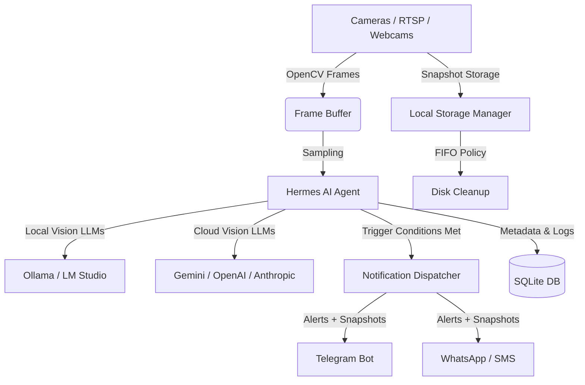

# AEGIS: Real-Time Edge Video Analytics & Intelligence Platform

AEGIS is an edge-native video intelligence platform that transforms standard video feeds (webcams, IP cameras, and RTSP streams) into smart, context-aware security systems. By combining local, vision-capable Large Language Models (Vision-LLMs) with automated notification channels, AEGIS allows you to define security and monitoring rules in plain, natural language.

---

## 💡 The Core Idea & Project Basis

Traditional security systems rely on basic motion detection or pre-trained, rigid object detection models (like YOLO) that can only detect generic categories (e.g., "person", "car"). They suffer from high rates of false positives (leaves blowing, shadows changing) and cannot understand complex contexts.

**AEGIS changes this by introducing Vision-LLMs to the edge.** Instead of writing code or configuring complex zones, you simply describe what you want to monitor in natural language:
* *"Detect if someone is holding a package near the door."*
* *"Alert me if the dog gets on the dark brown couch."*
* *"Check if a delivery truck parked in the driveway."*

The core background orchestrator, **Hermes**, continuously samples frames from your cameras, feeds them to your choice of local or cloud-based Vision-LLMs, evaluates the frame against your natural language triggers, and immediately dispatches rich alerts (complete with snapshots) directly to your messaging apps when a condition is met.

---

## 🌟 Why AEGIS is Useful

1. **Privacy-First & Local-First (Zero Cloud Dependency)**
   * Run completely offline using **Ollama** or **LM Studio** on your own hardware. 
   * Your private camera feeds never leave your local network, ensuring absolute privacy for home or business monitoring.
2. **Natural Language Triggering**
   * No programming, no training data, and no complex computer vision pipelines required. If you can describe it in English, AEGIS can detect it.
3. **Hybrid AI Engine**
   * Supports local offline models (e.g., `llava`, `qwen2-vl`, `deepseek-r1`) as well as high-performance cloud providers (Google Gemini, OpenAI GPT-4o, Anthropic Claude) through a unified API client.
4. **Instant Rich Notifications**
   * Delivers immediate alerts with event details and captured snapshots directly to **Telegram**, **WhatsApp**, or **SMS (via Twilio)**.
5. **Smart Storage & Retention**
   * Includes an automated local database and media storage manager utilizing a **FIFO (First-In, First-Out)** rotation strategy to keep disk usage within user-defined limits.
6. **Dual-Interface Management**
   * Features a beautiful desktop application (built with CustomTkinter) for local administration, alongside a modern web dashboard (React + Vite) for web-based control and monitoring.

---

## 🏗️ System Architecture

The following diagram illustrates how video frames flow from physical cameras through the Hermes analysis pipeline to trigger real-time notifications:



---

## 🛠️ Tech Stack & Key Components

* **Backend Core**: Python 3.10+, OpenCV (video capture and frame processing), SQLite & SQLAlchemy (data persistence).
* **AI Orchestration**: LangChain, Ollama API, and customized LLM client wrappers.
* **Desktop Interface**: CustomTkinter (modern, dark-themed native GUI).
* **Web Frontend**: React, Vite, Tailwind CSS / Vanilla CSS.
* **Notification Channels**: Telegram Bot API, Twilio API (SMS and WhatsApp).

---

## 🚀 Quick Start & Setup

To get AEGIS up and running, follow these high-level steps:

### 1. Installation
Clone the repository, set up a Python virtual environment, and install the required dependencies:
```bash
# Clone the repository
git clone https://github.com/bharathvk75/AEGIS.git
cd AEGIS

# Create and activate virtual environment
python -m venv venv
venv\Scripts\activate  # On Windows
source venv/bin/activate  # On macOS/Linux

# Install dependencies
pip install -r requirements.txt
```

### 2. Configure Local AI
Download and run a vision model locally using Ollama:
```bash
# Pull the recommended vision model
ollama pull llava
```

### 3. Run the Application
Start the main server and administrative interface:
```bash
python main.py
```

> [!NOTE]
> For a detailed step-by-step walkthrough of advanced settings, camera integrations, and notification channel configurations, please refer to our comprehensive [SETUP.md](SETUP.md) and [setup_guide.md](setup_guide.md).
